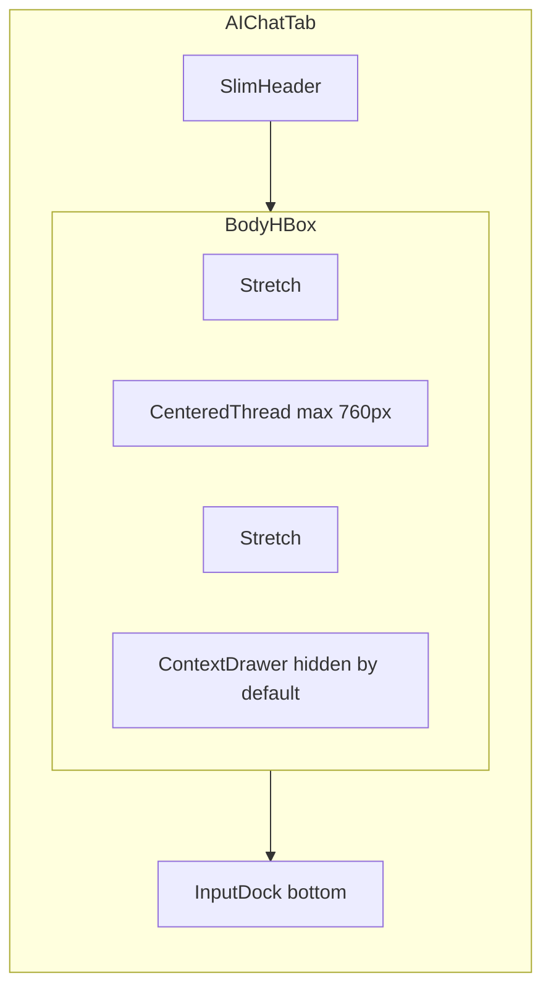

# AI Chat Tab Redesign Plan

## Goal

Transform the current vertically stacked [Assistant tab](app/assistant_tab.py) into a **ChatGPT-inspired "AI Chat" tab**: conversation-first, minimal header, centered thread, welcome prompts, and PC context tucked into a drawer. All backend behavior (`InferenceWorker`, `ActionWorker`, skills, confirmations) stays unchanged.

## Current Pain Points

The existing layout stacks everything vertically:

```323:430:app/assistant_tab.py
        outer = QVBoxLayout(self)
        ...
        header_layout = QHBoxLayout()   # title + 2 chips + 4 buttons
        subtitle = QLabel(...)          # always visible
        missing_model_panel             # conditional
        snapshot_toggle + snapshot_panel  # open by default, eats height
        scroll (chat)                   # only stretch item
        quick_layout (8 chip buttons)   # cramped single row
        input_layout (QLineEdit + Send)
```

This competes with the chat feed and feels more like a diagnostic form than a chat product.

## Target Layout (ChatGPT-inspired)



**Visual structure:**

```
┌──────────────────────────────────────────────────────────┐
│ AI Chat          [Ready]              [Context] [···]    │  ← slim header
├──────────────────────────────────────────────────────────┤
│                                                          │
│         ┌──────────────────────────────┐  ┌──────────┐   │
│         │  Welcome state OR chat thread │  │ PC       │   │
│         │  (max-width ~760px, centered) │  │ Context  │   │
│         │                               │  │ drawer   │   │
│         │  Assistant ◀ bubble           │  │ (toggle) │   │
│         │              User bubble ▶    │  │          │   │
│         │  [Action card]                │  │ snapshot │   │
│         └──────────────────────────────┘  └──────────┘   │
│                                                          │
├──────────────────────────────────────────────────────────┤
│  ┌────────────────────────────────────────────┐  [Send]  │  ← input dock
│  │ Ask about performance, cleanup, startup... │          │
│  └────────────────────────────────────────────┘          │
└──────────────────────────────────────────────────────────┘
```

## Design Decisions

| Area | Current | Proposed |
|------|---------|----------|
| Tab name | "Assistant" | **"AI Chat"** (keep class `AssistantTab` to avoid breaking imports/tests) |
| Header | Title + 2 chips + 4 buttons + subtitle | Title + single status chip + **Context toggle** + overflow menu (Clear, Recheck, Stop) |
| Snapshot | Collapsible panel above chat, default open | **Right drawer** (~300px), closed by default; opened via "PC Context" |
| Quick actions | 8 chips below chat | **Welcome prompt cards** (2×4 grid) shown only when chat is empty; reuse `QUICK_ACTIONS` |
| Messages | Full-width bubbles | **Aligned bubbles**: user right (~85% max width), assistant left, system/error centered narrow banners |
| Input | Single-line `QLineEdit` | **`QTextEdit`** input dock (2–4 lines); Enter sends, Shift+Enter newline |
| Empty state | None (blank scroll) | ChatGPT-style welcome: title, local-model note, prompt cards |
| Streaming | Blank assistant bubble | Add **typing indicator** bubble until first visible token, then replace with streaming bubble |
| Missing model | Panel above chat | **Replace welcome state** with install instructions + Recheck button |
| Action cards | Inline in feed | Keep inline (works well for confirm/cancel), restyle as compact "suggested action" cards |

## Component Refactor

Extract reusable widgets into a new module to keep [assistant_tab.py](app/assistant_tab.py) focused on orchestration:

**New file: [app/chat_widgets.py](app/chat_widgets.py)**

- `ChatMessageRow` — wraps `MessageBubble` with left/right/center alignment
- `MessageBubble` — move from assistant_tab (same API: `append_text`, `set_text`)
- `ActionCard` — move from assistant_tab (same confirm flow)
- `WelcomeState` — grid of prompt cards from `QUICK_ACTIONS`; emits `prompt_selected(label, prompt, include_cleanup)`
- `TypingIndicator` — small pulsing "Thinking…" row, shown/hidden during inference
- `ChatInputDock` — rounded `QTextEdit` + Send; emits `submitted(text)`
- `ContextDrawer` — snapshot rows + Refresh button; wraps existing `snapshot_summary_rows()` rendering

**Keep in [assistant_tab.py](app/assistant_tab.py):** all workers (`ModelLoadWorker`, `InferenceWorker`, etc.), signal wiring, history, streaming filter, action execution.

## Theme Updates ([app/theme.py](app/theme.py))

Add property-based styles matching existing dark palette (`#1e1f26` bg, `#6d8dff` accent):

- `role="chat-thread"` — transparent centered container
- `role="message-user"` / `message-assistant` — add `max-width` feel via layout; slightly rounder corners (10px), user bubble accent `#334a7d`, assistant `#252832`
- `role="welcome-card"` — hoverable prompt cards (like ChatGPT starters)
- `role="chat-input-dock"` — inset rounded input container
- `role="context-drawer"` — right panel border-left, slightly elevated bg
- `role="typing-indicator"` — muted italic caption inside assistant bubble shell
- `role="header-menu-btn"` — secondary icon/text button for overflow actions

No new color system — extend existing `DARK_STYLESHEET` conventions.

## Wiring Changes in AssistantTab

1. **Layout rebuild** in `__init__`: header → body `QHBoxLayout` (stretch + thread column + optional drawer) → input dock pinned bottom.
2. **WelcomeState visibility**: show when feed has no user/assistant messages; hide on first `_start_inference`.
3. **Context drawer toggle**: moves `_toggle_snapshot_panel` logic to drawer show/hide; snapshot still refreshes on tab load and after actions (unchanged).
4. **Header menu**: `Stop` visible only during inference; `Clear` clears feed and re-shows welcome state.
5. **Status chip**: consolidate model + inference state into one chip (`Ready`, `Loading model`, `Thinking`, `Running action`, `Model missing`).
6. **Remove** always-visible subtitle and bottom chip row.

## Main Window Updates ([main.py](main.py))

- Rename tab label: `"Assistant"` → `"AI Chat"`
- Placeholder text: `"Loading AI Chat..."`
- Add `"chat"` to `_TOOL_SEARCH` (keep `"assistant"` and `"ai"`)

No changes to `_on_assistant_action_requested` or lazy-load wiring.

## What Does NOT Change

- [app/assistant_core.py](app/assistant_core.py) — skills, actions, snapshot collection
- [app/ai_engine.py](app/ai_engine.py) — model loading, prompts, streaming
- Confirmation flow (`ActionCard` + `QMessageBox` for risky actions)
- `action_requested` signal and cross-tab routing
- Skill JSON filtering during stream
- Chat history cap (8 turns)

## Testing

- Run existing suite: `tests/test_assistant_tab_skills.py`, `tests/test_assistant_core.py`, `tests/test_ai_engine.py` — should pass without logic changes
- Manual smoke test checklist:
  - Empty state shows welcome cards; clicking one starts inference
  - User/assistant alignment looks correct at 1080×720 and narrower widths
  - Context drawer opens/closes without squashing thread below ~480px min width
  - Model missing state replaces welcome content
  - Action cards still confirm/cancel and emit tab actions
  - Enter/Shift+Enter behavior in input dock
  - Stop/Clear/Recheck from overflow menu

## Implementation Order

1. Create [app/chat_widgets.py](app/chat_widgets.py) with extracted + new widgets
2. Add theme styles for new roles
3. Rebuild [app/assistant_tab.py](app/assistant_tab.py) layout using new widgets (logic unchanged)
4. Update [main.py](main.py) tab naming and search keywords
5. Manual UI pass + run pytest

## Optional Follow-ups (Out of Scope Unless Requested)

- Markdown rendering in assistant bubbles (`QTextBrowser` + lightweight formatter)
- Conversation export from chat feed
- Persistent chat history across app restarts
- Animated typing dots via `QTimer` frame animation
