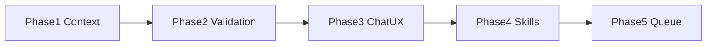

# AI Assistant Improvement Roadmap

**Focus:** AI Chat only — [`app/ai_engine.py`](app/ai_engine.py), [`app/assistant_core.py`](app/assistant_core.py), [`app/assistant_tab.py`](app/assistant_tab.py), [`app/chat_widgets.py`](app/chat_widgets.py), [`skills_list.md`](skills_list.md).

**Out of scope:** Health/Network/Cleanup tab polish, Reports history wiring, hardware/layouts JobQueue migration.

Safety invariant stays: LLM emits validated skill JSON only; Python resolves targets and confirms PC-changing actions. No arbitrary shell/PowerShell/Python execution.

---

## Current state (reviewed)

What exists today and is working — do not reinvent:

- Local Llama 3.2 3B Q4 via `llama-cpp-python`; Chat UI redesign largely shipped (`chat_widgets.py`, welcome prompts, context drawer, streaming).
- **39 skills / 39 tools**, all enabled; **15** confirm-gated. Toolbox Phase 1 is fully mirrored into skills; [`skills_list.md`](skills_list.md) matches code.
- Real safety pipeline: extract → validate → resolve → ActionCard → `execute_assistant_action`. Display/audio/layout resolution via `_single_match` already works.
- Allowlists already exist for settings pages, known folders, power plans, cleanup delete paths, startup toggles, protected processes.
- Solid test base (~58 assistant-related tests) for parse/validate/resolve/propose and prompt helpers.

Hard numbers that drive the roadmap:

| Metric | Current | Problem |
| --- | --- | --- |
| `n_ctx` | 2048 | Full prompt + 256 gen often exceeds window |
| `max_tokens` | 256 | OK once context fits |
| History | 8 turns, flattened as `User:`/`Assistant:` text | Burns tokens; not native Llama multi-turn |
| Skill catalog | Always full (~5.4k chars / ~45 lines) | Dominates every prompt |
| Prompt pressure | ~full catalog + snapshot + history ≈ ~1900 tokens before generation | Negative headroom vs 2048 |

Critical gaps (evidence-based):

1. **Context overcrowding** — `build_skill_catalog()` / `render_skill_catalog()` always injects all skills (`InferenceWorker` → `compose_user_prompt`).
2. **Double confirm + card lie** — `ActionCard._confirm` marks “Confirmed” then `AssistantTab._run_action` may show `QMessageBox`; Cancel leaves card saying Confirmed.
3. **Fail-open schema** — `_value_matches_schema` returns True for unknown types; unknown args not rejected.
4. **`scan_large_files.root` unconstrained** — unlike cleanup delete allowlists.
5. **Tab refreshes stale assistant snapshot** — `refresh_displays` / `refresh_audio` / `refresh_layouts` only load tabs via `action_requested`.
6. **Keyword fallback always merges** — can flood cards even when LLM already emitted skills.
7. **No adapter list / resolve** — snapshot network is counters only; `restart_network_adapter` needs a guessed name.
8. **Stop is unwired** — `stop_action = None`; `_stop_inference` exists but UI can’t use it.
9. **Workers bypass JobQueue** — direct `QThread.start()` for load/snapshot/inference/action.

Related plans: Chat redesign intentionally kept double-confirm (this roadmap supersedes that for Phase 3). Embedded LLM + Toolbox Phase 1 are done; this plan continues from there.

**Gate:** Do not ship Phase 4 skill waves until Phase 1 intent-filtered catalog is in. Adding ~20 skills onto always-full catalog makes the 3B worse.

---

## Phase 1 — Fix context overcrowding (highest priority)

**Goal:** Realistic prompts fit with generation headroom.

Primary files: [`app/ai_engine.py`](app/ai_engine.py), [`app/assistant_core.py`](app/assistant_core.py)

1. Raise `EmbeddedAI.n_ctx` from `2048` → `4096` (fall back only if load fails on target machines); keep `max_tokens` ~256–384.
2. **Intent-filtered skill catalog** — replace always-on full dump with: core set (health/process/cleanup/export) + domain skills matched to the question; full catalog only for “what can you do?”.
3. **Budgeted history** — hard char/token budget; prefer native Llama chat-header turns (or a tightly capped recent-conversation section) instead of stuffing 8 full turns into one user blob.
4. Tighten `DEFAULT_SYSTEM_PROMPT`: prefer 1 skill unless user asked for a plan; don’t invent targets; ask for refresh when snapshot data is missing.

**Done when:** Tests prove catalog filter + snapshot + recent history fit under `n_ctx` with gen headroom (`tests/test_ai_engine.py`).

---

## Phase 2 — Fail-closed skills and better targeting

**Goal:** Bad skill JSON never becomes a misleading ActionCard.

Primary files: [`app/assistant_core.py`](app/assistant_core.py), [`app/assistant_tab.py`](app/assistant_tab.py)

1. Fail-closed `_value_matches_schema` / `validate_skill_request` — reject unknown args and unknown schema types; keep required-field checks.
2. Allowlist `root` for `scan_large_files` / storage scan skills (home, Downloads, Desktop, Documents, temp, scanned cleanup roots) — never arbitrary paths.
3. Add `_resolve_adapter`, `_resolve_startup_item`, friendly `end_process` (name → PID from top processes); put adapter names into snapshot when network skills are relevant.
4. Gate `propose_actions`: only merge keyword cards when LLM emitted zero valid skills, or matches are high-confidence.
5. After `refresh_displays` / `refresh_audio` / `refresh_layouts`, also refresh `_current_snapshot` so the next turn resolves against live data.

**Done when:** Unit tests cover reject-unknown-args, path allowlist, new resolvers, fallback gating, snapshot sync.

---

## Phase 3 — Chat assistant UX fixes

**Goal:** Confirm/result UX matches the safety story (supersedes Chat redesign’s double-confirm choice).

Primary files: [`app/assistant_tab.py`](app/assistant_tab.py), [`app/chat_widgets.py`](app/chat_widgets.py)

1. **Single confirm path** — ActionCard only; remove second `QMessageBox` in `_run_action`. Card must not show “Confirmed” until the user actually confirmed (fix cancel lie).
2. Richer cards: resolved target, risk, one-line “what will happen”; after run, attach compact result summary on the card.
3. Clear status states: loading model / collecting snapshot / streaming / waiting for confirm / action running.
4. Wire Stop to `_stop_inference` (cooperative between tokens is enough for v1).
5. Smarter post-action follow-up — stop hardcoding `propose_actions("cleanup", …)` after every success; offer at most one domain-relevant next card.

**Done when:** Mutating skills confirm once; cancel doesn’t mark Confirmed; Stop works; follow-up isn’t always cleanup.

---

## Phase 4 — Expand skills (~20), waves A→B→C

**Goal:** Grow Chat capability by wrapping **existing** backends first. Update [`skills_list.md`](skills_list.md) in every skill change.

Primary files: [`app/assistant_core.py`](app/assistant_core.py), [`app/toolbox.py`](app/toolbox.py) / [`app/system_info.py`](app/system_info.py) / layouts/audio as needed.

### Wave A — Cleanup & storage (ship first)

| Skill | Confirm | Backend leverage |
| --- | --- | --- |
| `get_recycle_bin_size` | No | `_recycle_bin_size` |
| `empty_recycle_bin` | Yes | Allowlisted Recycle Bin only |
| `clean_temp_files` | Yes | Existing cleanup categories / scanned candidates |
| `clean_browser_cache` | Yes | Existing browser-cache categories |
| `clean_thumbnail_cache` | Yes | Existing thumbnail category |
| `scan_downloads_large_files` | No | `default_storage_scan_roots` / Downloads |
| `scan_desktop_large_files` | No | Desktop root wrapper |

### Wave B — Network triage (unblocks better mutate targeting)

| Skill | Confirm | Notes |
| --- | --- | --- |
| `list_network_adapters` | No | Feed snapshot + `restart_network_adapter` resolve |
| `check_dns_resolve` | No | Fixed host allowlist only |
| `ping_host` | No | Fixed host allowlist + count cap |
| `check_default_gateway` | No | “No internet” triage |
| `show_wifi_status` | No | SSID/signal if available; never passwords |

### Wave C — System helpers & openers

| Skill | Confirm | Notes |
| --- | --- | --- |
| `check_system_uptime` | No | `get_hardware_info()` already has `boot_time` |
| `check_memory_pressure` | No | Compact RAM/commit signals beyond snapshot % |
| `list_installed_gpus` | No | From hardware summary |
| `open_task_manager` | No | Fixed launcher |
| `open_resource_monitor` | No | Fixed launcher |
| `open_device_manager` | No | Fixed launcher |
| Expand `open_windows_settings` | No | Add `storage`, `power`, `privacy`, `troubleshoot`, `about` |
| Expand `open_known_folder` | No | Add `desktop`, `documents`, `pictures` |
| `capture_layout_snapshot` | Yes | `window_layouts.capture_current_layout` exists; only load is skilled today |
| `set_default_audio_device` | Yes | New fixed `audio_control` path + snapshot resolve |

**Rules:** Prefer wrapping existing code; mutating skills always confirm; hosts/folders/settings/cleanup categories stay allowlisted; Phase 1 domain map must include these new skills.

**Still out of scope:** arbitrary kill-by-path, registry editors, unrestricted deletion, cloud LLM, Wi‑Fi passwords, “run this PowerShell/Python”.

**Done when:** Waves A–C are catalogued, validated, executed, tested, and documented.

---

## Phase 5 — Assistant JobQueue only

**Goal:** Serialize assistant work without redesigning every tab.

1. Scopes: `assistant-inference`, `assistant-actions` via `get_job_queue().submit`.
2. Overlap → clear Chat status (“already running”).
3. Do not migrate hardware/layouts/cleanup tabs here.

**Done when:** Assistant workers no longer call bare `.start()` for inference/actions.

---

## Sequencing and effort

| Phase | Focus | Effort | Depends on |
| --- | --- | --- | --- |
| 1 | Context + catalog + history | ~2–3 days | — |
| 2 | Validation + resolution | ~3–4 days | Phase 1 recommended |
| 3 | Chat UX (confirm/Stop/follow-up) | ~2–3 days | Can parallel Phase 2 lightly |
| 4 | Skills A→B→C | ~5–7 days | **Phase 1 required** |
| 5 | Assistant JobQueue | ~1–2 days | After Phase 3 preferred |

Recommended ship order: **1 → 2 → 3 → 4A → 4B → 4C → 5**.

---

## Testing strategy

- Focused: `tests/test_ai_engine.py`, `tests/test_assistant_core.py`, `tests/test_assistant_toolbox_skills.py`, `tests/test_assistant_tab_skills.py`
- New coverage priorities: prompt-fit under `n_ctx`, catalog intent filter, reject-unknown-args, path allowlist, ActionCard-only confirm, fallback gating, new skill waves
- `py_compile` touched modules; full `pytest` before merging a phase
- Manual smoke: “why is my PC slow?”, cancel a confirm (card must not stay Confirmed), Stop mid-stream, empty recycle bin skill path, next-turn after display refresh
