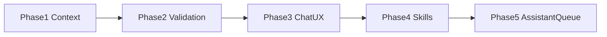

# AI Assistant Improvement Roadmap

**Focus:** the AI Chat assistant only — [`app/ai_engine.py`](app/ai_engine.py), [`app/assistant_core.py`](app/assistant_core.py), [`app/assistant_tab.py`](app/assistant_tab.py), [`skills_list.md`](skills_list.md), and assistant tests.

**In scope:** A (reliability) + B (new assistant skills) + C (Chat UX).

**Out of scope for this roadmap:** Health/Network/Cleanup tab polish, shared tab confirm helpers, Reports/`tool_history` cleanup wiring, hardware/layouts JobQueue migration, Cleanup scope splits. Those stay backlog items outside this plan.

Safety invariant stays: LLM only emits validated skill JSON; Python resolves targets and confirms PC-changing actions. No arbitrary shell/PowerShell/Python execution.

---

## Phase 1 — Make the assistant fit the context window

**Goal:** Fewer truncated/confused answers; skill requests stay grounded in the live snapshot.

Primary files: [`app/ai_engine.py`](app/ai_engine.py), [`app/assistant_core.py`](app/assistant_core.py)

1. **Raise and budget context** — Increase `EmbeddedAI.n_ctx` from `2048` to `4096` (or the highest value that still loads reliably on the 3B Q4 model), keep `max_tokens` modest (~256–384), and trim history more aggressively when the prompt is large.
2. **Intent-filtered skill catalog** — Replace always-on `render_skill_catalog()` in `compose_user_prompt` with a compact catalog: always include a short “core” set (health/process/cleanup/export), plus domain skills matched to the user question (network, display, audio, layouts, startup, storage). Keep the full catalog for explicit “what can you do?” prompts.
3. **Native multi-turn history** — Stop stuffing `User:`/`Assistant:` text into one user blob; format prior turns with Llama 3.2 chat headers (or a tight history section with a hard char budget) so continuity doesn’t burn the whole window.
4. **Tighten system prompt** — Update `DEFAULT_SYSTEM_PROMPT` to: prefer 1 skill request unless the user asked for a multi-step plan; refuse invented targets; say “I need a refresh first” when snapshot data is missing.

**Done when:** Prompt composition tests show catalog + snapshot + 4 history turns fit with generation headroom; focused `tests/test_ai_engine.py` coverage for catalog filtering and history budget.

---

## Phase 2 — Stricter skill validation and target resolution

**Goal:** Wrong or unsafe skill JSON fails closed in Python before Chat shows a card.

Primary files: [`app/assistant_core.py`](app/assistant_core.py), [`app/assistant_tab.py`](app/assistant_tab.py), [`tests/test_assistant_core.py`](tests/test_assistant_core.py), [`tests/test_assistant_toolbox_skills.py`](tests/test_assistant_toolbox_skills.py)

1. **Fail-closed schema checks** — In `validate_skill_request` / `_value_matches_schema`: reject unknown args, reject unknown schema types, require required fields.
2. **Path allowlisting for scan skills** — For `scan_large_files` / `scan_folder_sizes` / `scan_duplicate_files`, resolve `root` to an allowlisted set (home, Downloads, Desktop, Documents, temp, or currently scanned cleanup roots) — never pass arbitrary LLM paths through.
3. **Snapshot-based resolution for weak targets** — Add `_resolve_adapter`, `_resolve_startup_item`, and friendly `end_process` resolution (name/PID from top processes) using the same `_single_match` pattern as display/audio/layout.
4. **Tone down keyword fallback** — Gate `propose_actions` so it only adds cards when the LLM emitted zero valid skills, or when matches are high-confidence; stop flooding Chat with duplicate keyword cards (`InferenceWorker`).
5. **Keep assistant snapshot in sync after refreshes** — When `refresh_displays` / `refresh_audio` / `refresh_layouts` run via `action_requested`, also refresh the assistant snapshot (or call `execute_assistant_action`) so the next turn sees new data.

**Done when:** Unit tests cover reject-unknown-args, path allowlist, adapter/startup/process resolution, and fallback gating.

---

## Phase 3 — Chat assistant UX

**Goal:** Confirmation and skill results in Chat feel intentional and trustworthy.

Primary files: [`app/assistant_tab.py`](app/assistant_tab.py), [`app/chat_widgets.py`](app/chat_widgets.py)

1. **Single confirmation path** — Keep `ActionCard` as the only confirm UI for assistant skills; remove the second `QMessageBox` for the same action in `_run_action`.
2. **Richer action cards** — Show resolved target, risk, and a one-line “what will happen” before confirm; after run, attach a compact result summary on the card (success/errors), not only a status label.
3. **Clearer streaming/status feedback** — Distinct states for loading model, collecting snapshot, thinking/streaming, waiting for confirm, and action running/done — so users know whether the assistant is stuck or waiting on them.
4. **Post-action follow-up quality** — After a skill completes, briefly restate what changed using the action result (not a second full inference unless useful), and offer at most one sensible next skill card when appropriate.

**Done when:** Mutating skills confirm once via ActionCard; cards show target + outcome; Chat status states are unambiguous.

---

## Phase 4 — Assistant-first new skills

**Goal:** Expand what Chat can request through named, validated, confirm-gated skills. Update [`skills_list.md`](skills_list.md) in the same change for every skill touch.

Primary files: [`app/assistant_core.py`](app/assistant_core.py), [`app/toolbox.py`](app/toolbox.py) (backends only as needed for skills), [`skills_list.md`](skills_list.md)

Ship these first (highest Chat value, still conservative):

- `empty_recycle_bin` — common cleanup ask; allowlisted only; **confirm**
- Category-scoped safe clean (reuse existing cleanup categories / scanned candidates) — **confirm**
- `list_network_adapters` — feeds better `restart_network_adapter` resolution — read-only
- `check_dns_resolve` with a fixed host allowlist (e.g. `one.one.one.one`) — read-only
- `open_task_manager` and a small expansion of allowlisted `open_windows_settings` pages — no confirm, allowlisted only

New skills get `ASSISTANT_SKILLS` / `ASSISTANT_TOOLS` entries, validation/execution paths, tests, and `skills_list.md` rows. Tab buttons for the same actions are optional later and not required in this phase.

**Still out of scope:** arbitrary process kill by path, registry editors, unrestricted deletion, remote/cloud LLM, or “run this PowerShell” skills.

**Done when:** Each new skill has catalog entry + validate/execute path + tests + `skills_list.md` documentation.

---

## Phase 5 — Assistant runtime queue only

**Goal:** Serialize assistant work without redesigning every tab’s JobQueue usage.

Primary files: [`app/assistant_tab.py`](app/assistant_tab.py), [`app/job_queue.py`](app/job_queue.py)

1. Route inference through JobQueue scope `assistant-inference`.
2. Route skill/action execution through JobQueue scope `assistant-actions`.
3. Reject overlapping submits in those scopes with clear Chat status (“already running”).
4. Do **not** migrate hardware/layouts/cleanup tabs in this roadmap.

**Done when:** Assistant inference and actions go through `get_job_queue().submit`; overlapping assistant work is rejected cleanly.

---

## Suggested sequencing and effort

| Phase | Focus | Rough effort |
| --- | --- | --- |
| 1 | Context + catalog + history | ~2–3 days |
| 2 | Validation + resolution | ~3–4 days |
| 3 | Chat UX | ~2–3 days |
| 4 | New assistant skills | ~3–4 days |
| 5 | Assistant JobQueue | ~1–2 days |

Start with Phase 1+2 before Phase 4 — new skills make a weak catalog/validator worse.

---

## Testing strategy (every phase)

- Focused: `tests/test_ai_engine.py`, `tests/test_assistant_core.py`, `tests/test_assistant_toolbox_skills.py`, `tests/test_assistant_tab_skills.py`
- Compile-check touched assistant modules with `py_compile`
- Full `pytest` before merging a phase
- Manual smoke in AI Chat: “why is my PC slow?”, confirm one mutating skill once, verify next-turn snapshot awareness, check status labels through the full turn
