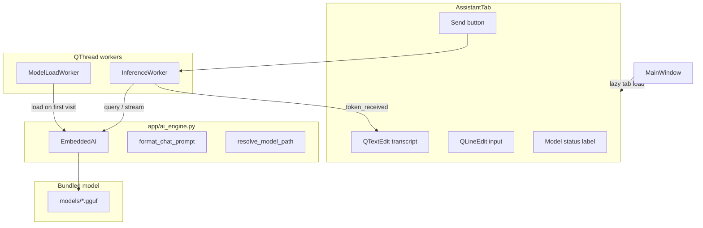

# Embedded Local LLM — Phase 1 Plan

## Goal

Integrate `llama-cpp-python` into PC Fixer as a fully in-process, offline assistant. Phase 1 delivers:

- Core inference module (`app/ai_engine.py`)
- New lazy-loaded **Assistant** tab with chat UI + model status
- Bundled-model workflow (`models/` directory, not committed to git)
- Unit tests for testable helpers (no real model required in CI)

Use-case wiring (intent routing, health reports, process explain) is explicitly **out of scope** for this phase.

## Architecture




Follows existing conventions from `[cleanup_tab.py](app/cleanup_tab.py)` (QThread + Signal) and `[main.py](main.py)` (lazy tab registry).

## File Changes

### 1. `[app/ai_engine.py](app/ai_engine.py)` (new)

Pure backend module — no Qt imports.

**Responsibilities:**

- `DEFAULT_MODEL_FILENAME` constant (e.g. `llama-3.2-1b-instruct-q4_k_m.gguf`)
- `resolve_model_path(filename)` — resolve from project root (`Path(__file__).parent.parent / "models"`), not from `app/` itself
- `model_exists(path)` / `missing_model_message(path)` — friendly error when `.gguf` absent
- `format_chat_prompt(system_prompt, user_prompt)` — Llama-3.2-Instruct chat template from your guide:
  ```
  <|system|>\n{system}<|end|>\n<|user|>\n{user}<|end|>\n<|assistant|>\n
  ```
- `EmbeddedAI` class:
  - Lazy `load()` — instantiate `Llama` only when called (keeps import fast if model missing)
  - `is_loaded` property
  - `query(system, user, max_tokens=256, temperature=0.3)` — blocking completion
  - `stream_query(...)` — generator yielding token strings (for streaming UI)
  - Defaults: `n_ctx=1024`, `n_threads=os.cpu_count() or 4`, `stop=["<|end|>", "\n\n"]`
  - Wrap `ImportError` / missing file in a small `AIEngineError` exception type

**Default system prompt (phase 1):** generic PC assistant persona, e.g. *"You are a helpful Windows PC assistant inside the PC Fix app. Answer concisely."*

### 2. `[app/assistant_tab.py](app/assistant_tab.py)` (new)

Qt UI only; delegates inference to `ai_engine`.

**Workers:**


| Worker            | Signal(s)                                       | Behavior                                |
| ----------------- | ----------------------------------------------- | --------------------------------------- |
| `ModelLoadWorker` | `finished_ok`, `error(str)`                     | Calls `EmbeddedAI.load()` once          |
| `InferenceWorker` | `token_received(str)`, `finished`, `error(str)` | Runs `stream_query()` off the UI thread |


**UI layout** (matches existing tab style — `role="heading"`, `role="caption"`, `variant="secondary"`):

- Header: "Assistant" + model status label ("Loading model...", "Ready", "Model not found", error text)
- Read-only `QTextEdit` transcript (user/assistant bubbles as plain formatted text)
- `QLineEdit` + Send button; Enter to send
- Disable input while model loads or inference runs; guard against duplicate workers (`isRunning()`)

**Lifecycle:**

- On first `showEvent` (or `__init__` after lazy swap): start `ModelLoadWorker` if model file exists; otherwise show `missing_model_message` with path hint
- On send: append user message, start `InferenceWorker`, append streamed tokens to assistant reply
- `worker.deleteLater()` on finish (same pattern as `[layouts_tab.py](app/layouts_tab.py)`)

### 3. `[main.py](main.py)`

Register Assistant as a lazy tab (model load is heavy — must not block startup):

```python
_LAZY_TABS = {
    ...
    6: ("app.assistant_tab", "AssistantTab", "Assistant"),
}
```

- Insert placeholder `"Loading Assistant..."` before Cleanup (or after — recommend **before Cleanup** so Assistant is tab index 6, Cleanup becomes 7)
- Update `_loaded_tabs` eager set: `{0}` only (remove Cleanup from eager if we want consistency, or keep Cleanup eager at index 7)

Recommended tab order: Dashboard | PC Setup | Display | Audio | Layouts | Startup | **Assistant** | Cleanup

### 4. `[requirements.txt](requirements.txt)`

Add:

```
llama-cpp-python>=0.3.0
```

Document optional CUDA build in `[models/README.md](models/README.md)` (not AGENTS.md — keep docs minimal per project norms):

```powershell
$env:CMAKE_ARGS="-DGGML_CUDA=on"
pip install llama-cpp-python --force-reinstall --no-cache-dir
```

(Note: upstream now uses `GGML_CUDA` rather than legacy `LLAMA_CUBLAS`.)

### 5. `[models/README.md](models/README.md)` (new)

Instructions for placing the bundled model:

- Recommended model: **Llama-3.2-1B-Instruct** GGUF, **Q4_K_M** (~800 MB–1 GB)
- Example Hugging Face repo + exact filename to download
- Expected path: `models/llama-3.2-1b-instruct-q4_k_m.gguf`
- PyInstaller packaging note for future builds:
  ```powershell
  pyinstaller --add-data "models\llama-3.2-1b-instruct-q4_k_m.gguf;models" main.py
  ```

### 6. `[.gitignore](.gitignore)`

Ignore large binaries but keep the folder:

```
models/*.gguf
```

Add `models/.gitkeep` so the directory exists in repo.

### 7. `[tests/test_ai_engine.py](tests/test_ai_engine.py)` (new)

Test pure helpers only (no GGUF file, no `Llama` import in CI):

- `resolve_model_path` returns project-root-relative path
- `format_chat_prompt` produces correct Llama-3.2 template
- `missing_model_message` includes filename
- `EmbeddedAI.query` / `stream_query` with `unittest.mock.patch` on `llama_cpp.Llama`

## Key Design Decisions


| Decision              | Choice                            | Rationale                                                                 |
| --------------------- | --------------------------------- | ------------------------------------------------------------------------- |
| Tab placement         | Lazy-loaded Assistant tab         | Model init is ~1–5 s and RAM-heavy; matches existing lazy pattern         |
| Model location        | `models/` at project root         | Bundled with app; too large for git                                       |
| Inference thread      | `QThread` worker                  | Blocks UI if run on main thread; unlike AudioTab, no COM constraint       |
| Streaming             | Yes, via `stream_query` generator | Better perceived latency in chat                                          |
| Chat template         | Llama-3.2-Instruct hardcoded      | Matches recommended model; generalize later if multi-model support needed |
| Phase 1 system prompt | Generic assistant                 | Use-case-specific prompts added in phase 2                                |


## Phase 2 Preview (not implemented now)

When ready, extend without restructuring:

- **Intent routing:** `parse_user_intent(text) -> Command` helper + `MainWindow` signal to switch tabs
- **Health summaries:** `build_system_context()` in `ai_engine.py` calling existing `[system_info.py](app/system_info.py)` helpers (`get_cpu_stats`, `get_memory_stats`, `get_top_processes`, `get_startup_items`)
- **Process explain:** context builder from selected Dashboard process row

## Manual Test Plan

1. Place a GGUF file at `models/llama-3.2-1b-instruct-q4_k_m.gguf`
2. `pip install -r requirements.txt`
3. Launch app → open Assistant tab → confirm "Loading model..." then "Ready"
4. Send a message → confirm streamed response appears without UI freeze
5. Rename/remove model file → confirm friendly missing-model message, no crash
6. `pytest` — all tests pass without a real model file

## Risks and Mitigations

- **Large download / git bloat:** `.gitignore` for `*.gguf`; README documents manual download
- **Slow first load:** Lazy tab + background `ModelLoadWorker`
- **RAM pressure on low-end PCs:** `n_ctx=1024`, small 1B model, document minimum ~2 GB free RAM in `models/README.md`
- **Wrong chat template for chosen model:** Document that filename/template are paired; add model metadata later if needed

