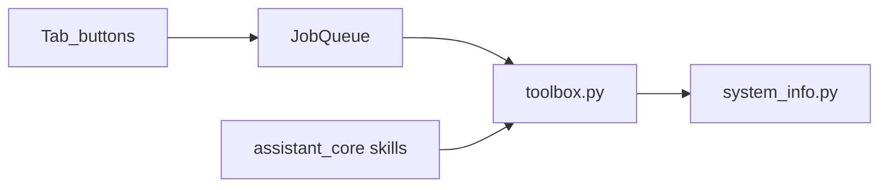

# Toolbox Phase 1

## Goal

Add the Phase 1 backlog tools from [new_toolbox_ideas](file:///C:/Users/ziemb/.cursor/plans/new_toolbox_ideas_48f36eb8.plan.md) without new unsafe surfaces: fixed named ops in [`app/toolbox.py`](app/toolbox.py), raw helpers in [`app/system_info.py`](app/system_info.py), JobQueue-backed tab buttons, mirrored assistant skills + [`skills_list.md`](skills_list.md).

Ship **one vertical slice at a time**, starting with storage (read-only, highest clarity win).



## Hard rules (unchanged)

- No arbitrary shell / PowerShell / Python / registry-edit / unrestricted delete
- Mutating ops: `requires_confirmation=True` in assistant + `QMessageBox` in tabs
- Slow work via `JobQueue` scopes (`cleanup`, `health-tools`, `network-tools`, `startup-tools`)
- Update `skills_list.md` in the same change as skills

## Slice A — Storage pack (implement first)

| Tool | Risk | Where |
|---|---|---|
| Large files UI | Read-only | Expose existing `scan_large_files` via Cleanup (or Health) `ToolRunner` |
| Folder size breakdown | Read-only | New toolbox op + Cleanup UI |
| Duplicate file scan | Read-only | New toolbox op + Cleanup UI (report only, no delete) |

**Implementation**

1. Promote reusable scans in [`app/system_info.py`](app/system_info.py): public folder-size walk (reuse private `_dir_size` pattern), duplicate grouping by size+hash (cap depth/roots: user profile / Downloads / Desktop by default).
2. Add/keep named ops in [`app/toolbox.py`](app/toolbox.py): `scan_large_files` (already), `scan_folder_sizes`, `scan_duplicate_files` → `ToolResult`.
3. Wire buttons in [`app/cleanup_tab.py`](app/cleanup_tab.py) through existing JobQueue scope `"cleanup"` (same pattern as Health/Network `ToolRunner` in [`app/toolbox_widgets.py`](app/toolbox_widgets.py)).
4. Add skills in [`app/assistant_core.py`](app/assistant_core.py) + docs in [`skills_list.md`](skills_list.md); route execute via existing `_execute_toolbox_action`.
5. Tests: [`tests/test_toolbox.py`](tests/test_toolbox.py), [`tests/test_assistant_toolbox_skills.py`](tests/test_assistant_toolbox_skills.py), unit tests for folder aggregation / duplicate grouping under `tests/`.

## Slice B — Repair pack (after A)

| Tool | Risk | Where |
|---|---|---|
| End process (safe) | Medium, confirm | Dashboard process table + skill |
| Disable/enable startup | Medium, confirm | Startup tab + skill |
| Renew IP | Low, confirm | Network tab + skill |
| Reset Winsock / TCP-IP | Medium, confirm | Network tab + skill |

**Implementation**

1. [`app/system_info.py`](app/system_info.py): `terminate_process(pid)` with hard denylist (PID 0/4, System, csrss, winlogon, services, etc.); `set_startup_item_enabled(...)` only for allowlisted HKCU/HKLM `...\Run` values and Startup-folder shortcuts already returned by `get_startup_items()`.
2. [`app/toolbox.py`](app/toolbox.py): `end_process`, `set_startup_item_enabled`, `renew_ip_address`, `reset_winsock` (fixed command paths only).
3. UI:
   - [`app/dashboard_tab.py`](app/dashboard_tab.py): End Process on selected row + confirm dialog
   - [`app/startup_tab.py`](app/startup_tab.py): Enable/Disable actions; migrate load/actions to JobQueue scope `"startup-tools"` (stop calling `worker.start()` directly)
   - [`app/network_tab.py`](app/network_tab.py): Renew IP / Reset Winsock with confirm copy mirroring DNS flush
4. Skills + `skills_list.md` with confirmation + risk text.
5. Tests focused on denylist/allowlist rejection and confirm flags.

## Slice C — QoL pack (after B)

| Tool | Risk | Where |
|---|---|---|
| Pending reboot check | Read-only | Health |
| Battery health report | Read-only | Health (`powercfg` summary parse) |
| Restart Explorer | Low, confirm | Health |
| Open Settings page / known folder | Soft helper | Health — fixed `ms-settings:` and folder allowlists only |

Wire via Health `ToolRunner` (`"health-tools"`), mirror skills, test allowlist rejection.

## Out of scope for this plan

Phase 2/3 backlog (SFC/DISM, Defender scan, hosts edit, free-form delete), packaging/model onboarding, Performance-tab redesign, AI intent routing.

## Verification

Per slice:

```powershell
.\venv\Scripts\python.exe -m py_compile app\system_info.py app\toolbox.py app\cleanup_tab.py app\assistant_core.py
.\venv\Scripts\python.exe -m pytest tests\test_toolbox.py tests\test_assistant_toolbox_skills.py -q
```

Manual: run app → exercise new buttons → confirm mutating actions show a dialog → confirm assistant skill cards match `skills_list.md`.

## Immediate execution order

Start with **Slice A only** until it is merged/verified, then B, then C. Do not land all three packs in one change.